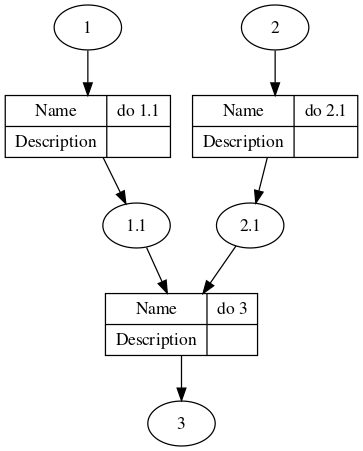

# workflowchart

This tool shows the flow chart for a workflow described as STEPS linking from INPUTS to OUTPUT.

For example 

```r
library(workflowchart)
steps <- data.frame(name = c("do 1.1", "do 2.1", "do 3"), 
                    from = c("1", "2", "1.1, 2.1"), 
                    to = c("1.1", "2.1", "3")
                    )
## knitr::kable(steps)
"
|name   |from     |to  |
|:------|:--------|:---|
|do 1.1 |1        |1.1 |
|do 2.1 |2        |2.1 |
|do 3   |1.1, 2.1 |3   |
"
nodes <- workflowchart(indat = steps, names_col = "name", in_col = "from", out_col = "to")
DiagrammeR::grViz(nodes)
```


